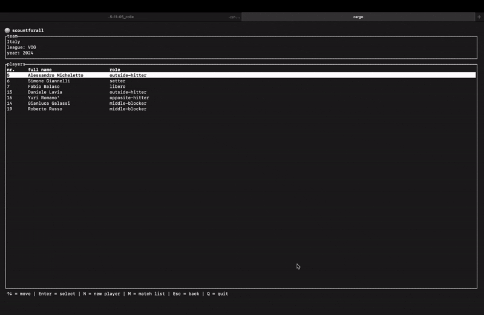

# scout4all

**scout4all** is a CLI application for collecting, managing and **reporting** volleyball match data.  
It helps coaches and analysts track match events and generate useful reports for post-game analysis.

## reporting features

- **match summary**: automatically generates a summary of each match, including scores, rotations and key events; statistics can be broken down by phase and by individual rotation
- **player statistics**: provides per-player stats such as points, errors, substitutions and general efficiency
- **custom filters**: filter reports by player, event type, set, phase or rotation

## requirements

- rust (stable)
- terminal compatible with [crossterm](https://github.com/crossterm-rs/crossterm)
- Linux, macOS, or Windows

## contributing

Pull requests and bug reports are welcome!